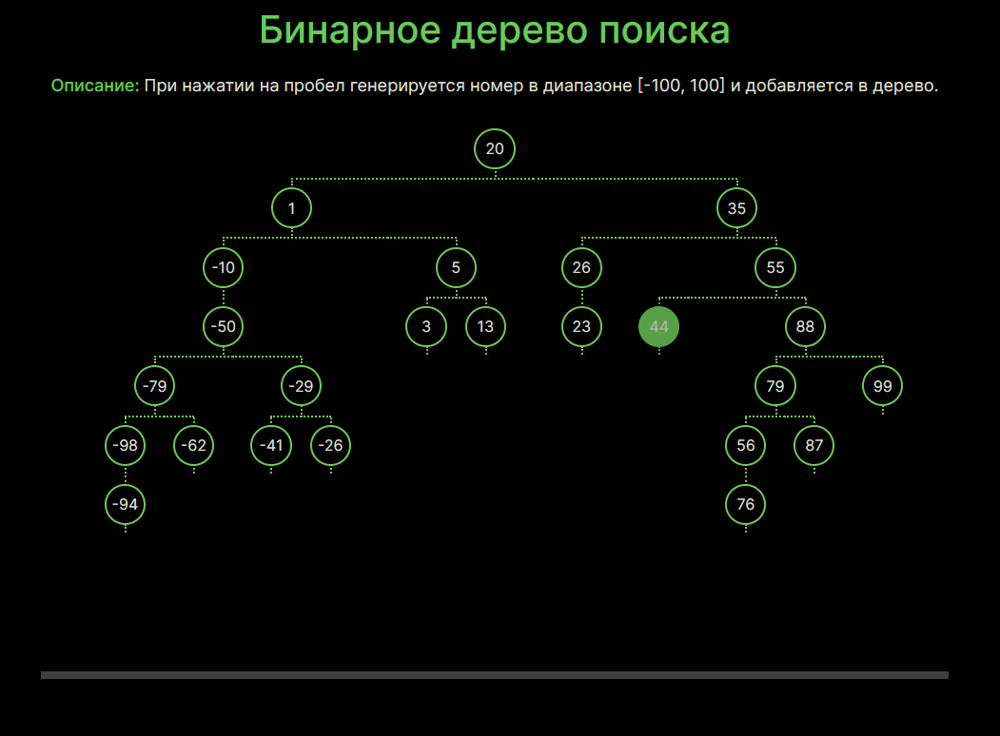

# Бинарное дерево поиска

---

Посмотреть [DEMO-версию](https://julbrn.github.io/binary-search-tree)

---

Одностраничный сайт создан при помощи [Create React App](https://github.com/facebook/create-react-app).

## Доступные команды

### `npm start`

Открывает сайт в режиме разработки на локальном сервере [http://localhost:3000](http://localhost:3000).

### `npm run build`

Создаёт оптимизированную сборку приложения в папке `build`, когда сайт готов к развёртыванию в продакшене.
